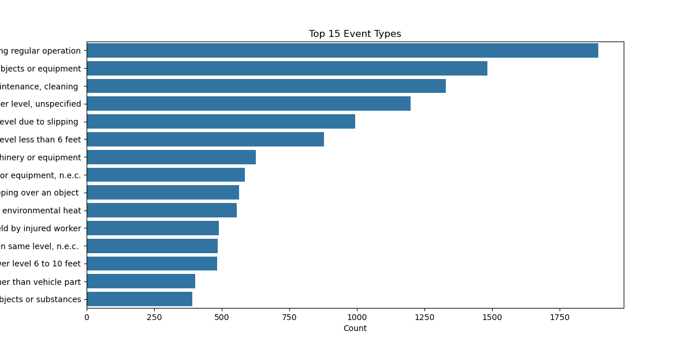

# 🏥 Severe Injuries Analysis Dashboard

[](https://www.linkedin.com/in/mohamed-emad-396981344/)  
[](mailto:mohamedemad24649@gmail.com)  

---

## 📖 Project Overview

This project provides a **comprehensive analysis of severe injuries** across different workplaces and industries.  
It uses historical injury records from 2015–2017 to examine **hospitalizations, amputations, event types, body parts affected, and sources of injuries**.  
The analysis was performed using **Python (pandas, seaborn, matplotlib)** and results are presented as charts for decision support and safety improvement.
**Power BI dashboard** analyzing **severe workplace injuries in the U.S. (2015–2017)**.  
The goal is to identify **key trends, high-risk sources, and actionable recommendations** for improving workplace safety.  

---

## 📂 Repository Structure
```
severe-injuries-analysis/
│
├── data/ # CSV datasets
│ ├── severeinjury.csv
│ ├── Event.csv
│ ├── Nature.csv
│ ├── Part.csv
│ └── Source.csv
│
├── SQL/ # queries by SMSS
|   └── queries.sql
├── python/ # Python script for analysis & charts
|   └── Analysis.ipynb
├── charts/ # Generated charts
│ ├── severity_distribution.png
│ ├── injuries_per_year.png
│ ├── top_employers.png
│ └── ... (all 11 charts)
|
├── power bi/ # Power BI dashboard
|   └── dashboard.pbix
│
└── README.md # This file
```

---

## 🔬 Data Analysis & Findings

### 1️⃣ Top 15 Sources of Injuries

- Highest: **Floor, n.e.c.** (~1300 injuries)
- Remaining sources range 150–600 injuries
- Trend: clear descending order with minor variations

### 2️⃣ Top 15 Nature Types

- Highest: **Fractures** (~6000 injuries)
- Followed by **Amputations** (~5500–6000)
- Others: Cuts, lacerations, unspecified injuries
- Trend: dominant high-frequency injuries

### 3️⃣ Top 15 Event Types

- Highest: “Riding regularly operation?” (~1800–1900)
- Other events: 500–1500
- Trend: descending pattern with small variations

### 4️⃣ Top 15 NAICS Sectors

- Highest: **622110 (Hospitals)** (~500 injuries)
- Others: 213112, 491110, 445110, 236220, etc.
- Trend: fairly uniform with minor differences

### 5️⃣ Top 20 Cities

- Highest: **Houston** (~400 injuries)
- Others: Orlando, Chicago, Dallas (~220–250)
- Trend: concentrated in major urban areas

### 6️⃣ Top 15 States

- Highest: **Texas** (~3500 injuries)
- Followed by Florida, Pennsylvania, Ohio, Illinois, etc.
- Trend: few states account for majority of injuries

### 7️⃣ Monthly Injuries Trend

- Observed peak in mid-2016 and early 2017
- Example: Jan 2015 ~850, Aug 2016 ~1060, Jan 2017 ~840

### 8️⃣ Top 10 Body Parts Injured (Hospitalized)

- Head/Neck (~2800–2900)
- Fingertip(s) (~2400)
- Nonclassifiable (~1400–1500)
- Others: Arm, Leg, Hip, Brain, Ankle

### 9️⃣ Top 10 Employers with Severe Injuries

- Highest: **U.S. Postal Service** (~130 injuries)
- Others: 60–120 injuries
- Trend: few employers dominate injury counts

### 🔟 Injuries per Year

- 2015: ~9900
- 2016: ~10150
- 2017: ~1600
- Note: significant peak in 2016, sharp decline in 2017
---

## 💡 Key Findings

- Injuries are **highly concentrated** in a few states, cities, and employers.
- **Fractures and amputations** dominate injury types, requiring targeted safety protocols.
- Certain sectors (Hospitals, Manufacturing) experience consistently higher injury rates.
- Monthly trends reveal **seasonal spikes**, highlighting periods for intensified safety training.
- Floor-related incidents are the most common source of injury.

---

## 🛠 Recommendations

1. Implement **floor safety protocols** and slip/trip prevention.
2. Focus training and safety audits on **high-risk employers and sectors**.
3. Monitor and prepare for **monthly peak periods** with extra safety measures.
4. Develop targeted **protective gear** and ergonomic solutions for the most affected body parts (head, fingertips, arms).
5. Continuous data tracking to assess the impact of **interventions over time**.

---

## 📊 Charts & Visualization

All charts are saved under the `charts/` folder and include:

- Severity Distribution
- Injuries per Year
- Top 10 Employers
- Top 10 Body Parts Injured (Hospitalized)
- Monthly Injuries Trend
- Top 15 States
- Top 20 Cities
- Top 15 NAICS Sectors
- Top 15 Event Types
- Top 15 Nature Types
- Top 15 Sources

---

## 📊 Power BI dashboard Pages

1. **Overview** → KPIs (Total Injuries, Hospitalizations, Amputations) + Monthly Trend  
2. **Injury by Source** → Top 15 sources of injuries (floor, ladders, platforms…)  
3. **Injury by Nature** → Distribution of injury types (Hospitalized, Amputation, etc.)  
4. **Injury by Event** → Top 15 injury-causing events  
5. **Body Part Analysis** → Most affected body parts (Top 10 hospitalized)  
6. **Employer Analysis** → Top employers with severe injuries  
7. **Geographical Distribution** → Injuries by State/City (Houston as Top City)  
8. **Trend Analysis** → Yearly & Monthly injury patterns (2015–2017)  
9. **Insights & Recommendations** → Key findings + suggested interventions  

---

## 👤 Author
**Mohamed Emad Alhadi Abdalla – Data Analyst**
